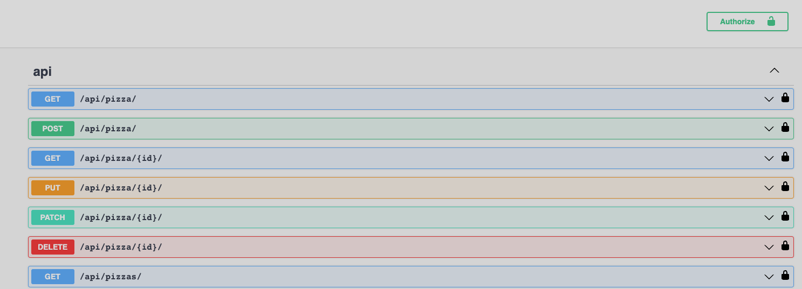

# Django Pizza Menu Project

This is a Django project that allows users to order pizzas from a menu.

## Table of Contents
* Installation
* Running the Application
* Database
* Server
* Testing
* Contributing
* Documentation

## Installation

1. Clone the repository to your local machine using 
   2. ``` git clone https://github.com/abdulra7ma/pizza_project.git ```
2. Create a virtual environment for the project using python -m venv env.
3. Activate the virtual environment using source env/bin/activate (Linux/Mac) or env\Scripts\activate (Windows).
4. Install the project dependencies using 
   5. ```pip install -r requirements.txt. ```

## Running the Application
1. Activate the virtual environment using source ```env/bin/activate``` (Linux/Mac) or ```env\Scripts\activate``` (Windows).
2. Run the Django development server using 
   3. ```python manage.py runserver.```
3. Access the application in your browser at http://localhost:8000/.

## Database
this project does support both `sqlite` and `postgres` DB

1. Install PostgreSQL on your machine. You can download PostgreSQL from the official website: https://www.postgresql.org/download/
2. Once PostgreSQL is installed, open the command prompt and enter the following command to create a new database:
```bash
createdb pizza_menu_db
```
3. Next, create a new user for the database. Enter the following command:
```bash
createuser -P pizza_menu_user
```
4. When prompted, enter a password for the new user.
5. grant all privileges on database pizza_menu_db to pizza_menu_user;
```bash
grant all privileges on database pizza_menu_db to pizza_menu_user;
```
6. Update the DATABASES setting in your Django project's settings.py file with the following information:
```python
DATABASES = {
    'default': {
        'ENGINE': 'django.db.backends.postgresql',
        'NAME': 'pizza_menu_db',
        'USER': 'pizza_menu_user',
        'PASSWORD': 'your_password',
        'HOST': 'localhost',
        'PORT': '5432',
    }
}
```
Replace "your_password" with the password you created for the new user.
7. Migrate the database using the following command:
```bash
python manage.py migrate
```

## Server
The application is served using the Django development server by default. However, for production deployment, you can use any server that supports WSGI, such as Apache or Nginx.

## Testing
1. Activate the virtual environment using 
   2. ``` source env/bin/activate ``` (Linux/Mac) 
   3. ``` env\Scripts\activate ``` (Windows).
2. Run the tests using 
   3. ```python manage.py test.```

## Contributing
1. Fork the repository on GitHub.
2. Clone the forked repository to your local machine using 
   3. ``` git clone https://github.com/abdulra7ma/pizza_project.git ```
3. Create a new branch for your changes using 
   4. ``` git checkout -b feature/your-feature-name. ```
4. Make your changes and commit them with a descriptive commit message.
5. Push your changes to your forked repository using 
   6. ``` git push origin feature/your-feature-name. ```
6. Open a pull request on the original repository.


## Documentation

The project documentation is available in the `docs` directory. It includes:

* API documentation
  * Swagger Docs
    * 


